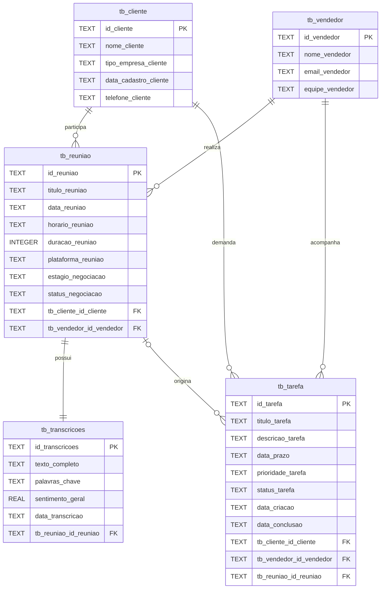

# Esquema organizacional do banco

O Torus mantém suas tabelas operacionais para não quebrar login, clientes, tarefas e análises. Como complemento, o banco contém as quatro tabelas exigidas no modelo de dados e a `tb_tarefa`, acrescentada para organizar o acompanhamento comercial. Elas são preenchidas inicialmente com o histórico existente e atualizadas por gatilhos do SQLite quando a aplicação grava ou altera registros.

## Correspondência com a aplicação

| Tabela exigida | Origem operacional | Observação |
|---|---|---|
| `tb_cliente` | `customers` | Segmento preenche o tipo de empresa; telefone fica disponível para cadastro futuro |
| `tb_vendedor` | `users` | Somente usuários com perfil de vendedor; a equipe padrão é Comercial |
| `tb_reuniao` | `meetings` | Data e horário vêm do registro; duração ainda não é coletada e começa em zero |
| `tb_transcricoes` | `meetings` | Reúne o texto das falas, termos encontrados e sentimento normalizado de 0 a 1 |
| `tb_tarefa` | `tasks` | Organiza prazos, prioridades e situação; a reunião de origem é opcional e o vendedor vem da carteira do cliente |

Os tipos `VARCHAR2`, `DATE` e `NUMBER` do diagrama de referência são tipos do Oracle. No SQLite, foram usados `TEXT`, `INTEGER` e `REAL`, preservando os mesmos campos e relacionamentos. As chaves da camada organizacional são textuais, seguindo o padrão do modelo fornecido.

As tabelas operacionais continuam sendo a fonte usada pela API. Essa separação evita uma migração destrutiva e mantém todos os recursos já implementados. Prioridades e situações são apresentadas na camada organizacional como `Normal`, `Alta`, `Pendente` e `Concluída`.
